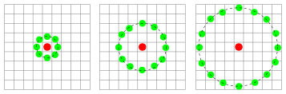
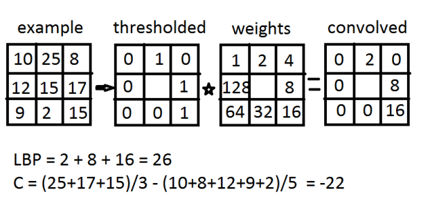
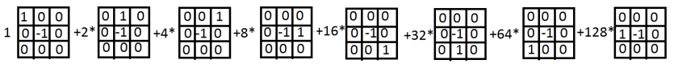
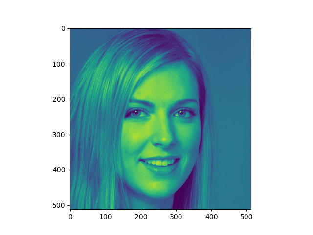
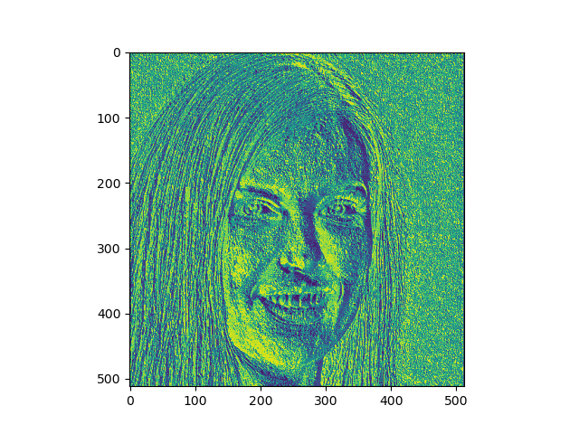
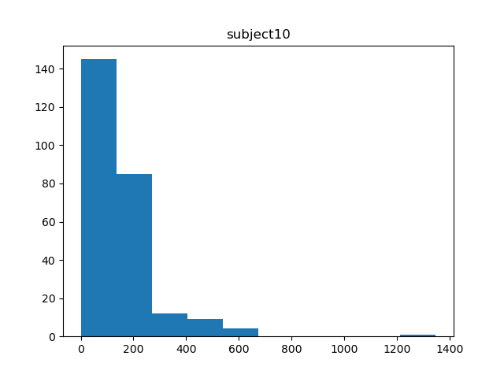
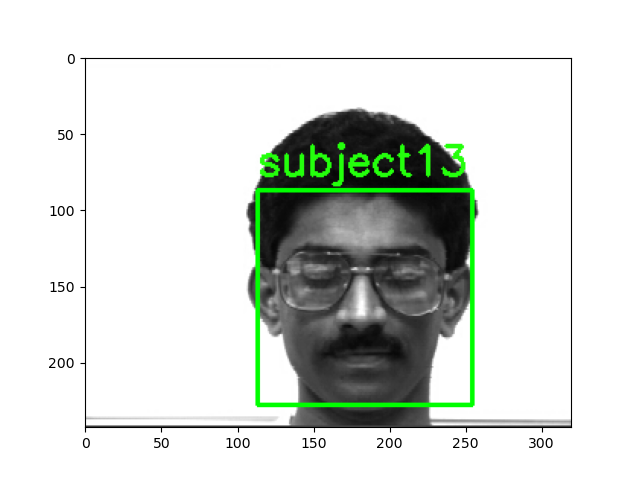

# Final project for the Pattern Recognition class

## About:
This project it's about performing face recognition using 
LBPH. The reason for using this kind of techniques for computer
vision its computational costs, I know machine learning its
more precise, but takes a lot of time in order to produce results, 
moreover, needs big datasets.

For a more detailed explanation of how the algorithm it's implemented you can 
visit [Facial Recognition with LBPH in Python]()

### The LBPH algorithm

#### LBP
Local binary patterns (LBP) is a type of visual descriptor used for classification
in computer vision. LBP is the particular case of the Texture Spectrum model 
proposed in 1990. LBP was first described in 1994.[1]

>Three neighborhood examples used to define a texture and calculate a local binary pattern (LBP)

The LBP feature vector, in its simplest form, is created in the following manner:

* Divide the examined window into cells (e.g. 16x16 pixels for each cell). 
* For each pixel in a cell, compare the pixel to each of its 8 neighbors (on its 
  left-top, left-middle, left-bottom, right-top, etc.). Follow the pixels along a 
  circle, i.e. clockwise or counter-clockwise.
* Where the center pixel's value is greater than the neighbor's value, write "0". 
  Otherwise, write "1". This gives an 8-digit binary number (which is usually 
  converted to decimal for convenience). 
* Compute the histogram, over the cell, of the frequency of each "number" occurring
  (i.e., each combination of which pixels are smaller and which are greater than 
  the center). This histogram can be seen as a 256-dimensional feature vector. 
* **Optionally** normalize the histogram.
* Concatenate (normalized) histograms of all cells. This gives a feature vector for
  the entire window.
  
**The LBP as a bank of filters**

For optimization reasons the project uses the convolve function, in this case
the lbp algorithm it's performed with a series of filters, and a convolve operation.
A resource that explains this is founded in [2].

> Example of how LBP is calculated

>LBP shown as filter bank

## The implementation:

The LBP algorithm will perform the neighborhood filtering, 
resulting in something like this:

>Original image 

>Image after LBP processing

Next, the image it's interpreted as a histogram with the levels of
gray scale.

>Histogram example 

After all the images of the same subject are processed it's time
to make a mean of all the histogram (this is called class histogram).

When we have calculated all the classes the model it's "trained" and
you only need to compare a given image (not from the training set)
with every class using a distance algorithm (Euclidean, Chi-square, Manhattan, etc)
and select the minor distance to say that's the most possible
identified subject.

>Example of the identified subject (can be inaccurate)

## Conclusions:
With this algorithm the Precision is about 65-80%, 
with a tiny dataset of 150 images and 11 distinct subjects.
With dataset greater the precision it's better (about 75-85%).

It's not a big precision rate, but this algorithm takes only a couple 
of minutes to perform the output in a decent PC, compared with
machine learning techniques that can take half an hour and 1K image 
dataset at least I think it's not bad.

## References:
> [1] T. Ojala, M. Pietikäinen, and D. Harwood (1994), "Performance evaluation of texture
> measures with classification based on Kullback discrimination of distributions", 
> Proceedings of the 12th IAPR International Conference on Pattern Recognition 
> (ICPR 1994), vol. 1, pp. 582 - 585.

>[2] devangini, «Local binary patterns(Lbp)», Devangini Patel, 03-jun-2016. 
> [Online]. Disponible en: https://devanginiblog.wordpress.com/2016/06/03/local-binary-patterns-lbp/. 
> [Accessed: 23-abr-2021]
